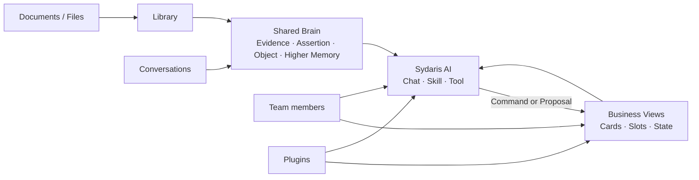

# Sydaris

> A shared workspace where organizational knowledge, business operations, and AI grow together.

Sydaris 让团队把资料、长期知识和日常业务放进同一个持续生长的工作空间。

成员通过 Business View 推进真实工作；AI 可以理解当前业务状态、追溯原始资料、调用专业 Skill，并在授权范围内提出或执行修改。组织积累的知识与状态会跨越成员、Agent 和会话持续存在。

当前版本为 `0.1 alpha`。

## 核心体验

### 从资料建立长期知识

在 Library 中导入组织资料，选择适合的处理方式，Sydaris 会保留稳定的来源文档，并将其中的信息编译为可追溯的知识。

发布后的 Evidence、Assertion、Object 与 Higher Memory 共同组成 Shared Brain。AI 可以按主题检索知识、沿 Object 探索上下文，并在需要时回到原始章节核对来源。

### 用 Business View 组织真实工作

每个 View 面向一个清晰的业务领域，拥有自己的 Cards、字段、关系、规则和操作。

社团信息、活动运营和比赛记录可以使用不同的业务模型，同时共享同一套知识基础。团队可以随时接入新的 View，也可以为现有 View 配置专属界面与 AI 能力。

### 与理解业务的 AI 协作

Sydaris AI 会结合三类上下文工作：

- Business View 中的当前正式状态
- Shared Brain 中积累的组织知识
- Library 中可回读的原始资料

AI 可以回答问题、整理信息、调用外部工具、激活专业 Skill，并将业务修改交给 Domain Command。需要确认的修改会先形成 Proposal，供成员审核后执行。

## 工作方式



资料和对话沉淀为长期知识，Business View 保存当前业务状态。AI 同时理解这两部分，并通过正式 Command 参与工作。

## 核心概念

### Shared Brain

| Concept | 含义 |
| --- | --- |
| `Evidence` | 可定位到原文或对话的来源内容 |
| `Assertion` | 带来源与时间背景的信息陈述 |
| `Object` | 连接不同来源与业务内容的稳定认知锚点 |
| `Higher Memory` | 为 AI 持续维护的高层认知与导航上下文 |

每份来源拥有稳定的 Source Document 身份。资料重新编译后，Shared Brain 会原子更新到该来源的最新发布版本。

### Business View

| Concept | 含义 |
| --- | --- |
| `Card` | View 中的业务实体 |
| `Dimension` | Card 上的类型化业务值 |
| `Slot` | View 内 Card 之间的业务关系 |
| `Related Object` | Card 与 Shared Brain Object 的连接 |
| `Command` | 创建或修改正式业务状态的操作 |
| `Proposal` | 等待审核的 Command 建议 |

每个 View 在共享认知底座上声明自己的业务模型。所有正式修改沿相同的 Command 路径执行，并通过 `stateVersion` 处理并发；执行记录同时保存产生的 Domain Events。

## 内置 Plugin

| Plugin | 业务范围 |
| --- | --- |
| `sydaris.society-information` | 组织身份、人物、学年职位、长期活动与平台入口 |
| `sydaris.activity-operations` | Activity 的任务、分工、预算、采购、报销、材料、审批、结果与复盘 |
| `sydaris.competition-records` | 比赛届次、长期赛事系列与来源数据同步 |

Competition Records 可以连接 USTCTTA 比赛源库；配置 `USTCTTA_DATABASE_URL` 或 `USTCTTA_DATABASE_URL_UNPOOLED` 后即可启用来源读取与同步能力。

## 本地运行

### 环境要求

- Node.js 20+
- pnpm
- PostgreSQL，或仓库提供的 Prisma 本地开发数据库
- 一个 OpenAI-compatible 文字模型
- Python 3.11 或 3.12 与 [`uv`](https://docs.astral.sh/uv/)

完整 Shared Brain 检索使用 BGE-M3。MinerU 与视觉模型用于相应文档和图片的深度处理。

### 1. 安装与配置

```bash
pnpm install
cp .env.example .env
```

在 `.env` 中填写文字模型：

```env
AI_API_KEY=
AI_API_BASE_URL=https://api.openai.com/v1
AI_MODEL=
```

`.env.example` 还包含数据库、模型限速、视觉模型、Library、Shared Brain 与调试选项。

### 2. 启动数据库

```bash
pnpm prisma:dev
pnpm prisma:deploy
pnpm prisma:generate
```

使用已有 PostgreSQL 时，在 `.env` 中配置 `DATABASE_URL` 和 `SHADOW_DATABASE_URL`。

### 3. 启动 Shared Brain 检索

在独立终端启动 BGE-M3 embedding 服务：

```bash
pnpm memory:serve-embeddings
```

首次运行可能下载模型。也可以通过 `COLD_START_EMBEDDING_MODEL` 使用本地模型路径。

轻量界面预览可以设置 `MEMORY_RETRIEVER_MODE=disabled`；完整认知体验使用默认的 `object-assertion` 模式。

### 4. 启动 Sydaris

```bash
pnpm dev
```

访问 [http://localhost:3000/setup](http://localhost:3000/setup) 创建第一个管理员。进入 Library 导入资料并启动基础编译，完成后即可在 Shared Brain 与 AI 对话中使用这些知识。

认知编译、Parser 和 embedding 服务的详细说明见 [`services/cold-start`](services/cold-start/README.md) 与 [`services/mineru-parser`](services/mineru-parser/README.md)。

## 用 Plugin 扩展 Sydaris

一个 Plugin 可以组合四类 Extension：

| Extension | 提供的能力 |
| --- | --- |
| `ViewModule` | 业务状态、Commands、Invariants 与 Events |
| `PresentationExtension` | 面向该 View 的专属界面与交互 |
| `SkillExtension` | AI 的专业工作流程与 Command 权限 |
| `ToolProviderExtension` | 日历、邮件和业务系统等外部 Capability |

Plugin 使用静态注册，与 Sydaris 一起构建：

```bash
pnpm sydaris:plugin install ./my-plugin.tgz
pnpm sydaris:plugin list
pnpm sydaris:plugin generate --check
```

- [`packages/plugin-sdk`](packages/plugin-sdk/README.md)：公共 TypeScript contracts、React hooks 与包格式
- [`packages/example-plugin`](packages/example-plugin/README.md)：可复制的完整 Plugin 示例
- [`CONTRIBUTING.md`](CONTRIBUTING.md)：Runtime 边界、开发流程与验证要求

## 仓库结构

```text
src/
├── contracts/        Stable Runtime contracts
├── runtime/          Extension host / Tool runtime
├── view-runtime/     View state, Command and Proposal runtime
├── agent-runtime/    AI-facing View, Skill and Tool runtime
├── ai/               Chat orchestration and grounding
├── memory/           Shared Brain / Cognitive Runtime
├── evidence/         Evidence-layer semantics
├── library/          Source documents and knowledge compilation
├── plugins/          First-party Plugins
├── integrations/     Host-owned external workflows
├── shell/            Composition Root
├── app/              Next.js application and API routes
└── auth/             Identity and session

packages/
├── plugin-sdk/       Public Plugin SDK
└── example-plugin/   Publishable example

services/
├── cold-start/       Cognitive compilation and BGE-M3 service
└── mineru-parser/    Document parser service

prisma/               Current schema and initial migration baseline
```

## 当前阶段

Sydaris `0.1 alpha` 聚焦于完整的知识—业务—AI 协作闭环：

- 每个 Sydaris 实例使用一个 Shared Brain。
- Plugin SDK 和公共 API 会在首个稳定版本前继续演进。
- 当前 Plugin 模型面向可信包，并采用静态安装与构建。
- 第一版支持 Plugin 安装与完整移除；升级、数据迁移与回滚将在后续版本完善。
- 外部副作用 Tool 将随人工审批体验一起逐步开放。

## 验证

```bash
pnpm lint
pnpm test
pnpm exec tsc --noEmit
pnpm prisma validate
pnpm build
```

## 参与项目

开发流程与架构约定见 [`CONTRIBUTING.md`](CONTRIBUTING.md)。

## 许可证

Sydaris 使用 [Apache License 2.0](LICENSE)。
