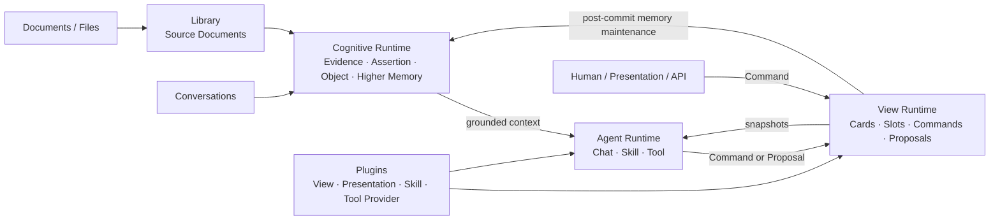

# Sydaris

> A runtime for software where humans and AI share durable business state and organizational knowledge.

Sydaris 是面向人类与 AI 协同工作的软件 Runtime。它让组织的业务状态、原始资料和长期认知独立于具体成员、Agent 与单次会话持续存在。

当前版本为 `0.1 alpha`，公共合同尚未稳定。

## Sydaris 能做什么

- 用 Business View 表达不同领域的业务模型，而不是要求所有业务服从一个全局 ontology。
- 让人、AI、Skill、专属 UI 和外部系统通过同一套 Domain Command 修改业务状态。
- 把文档与对话中的信息编译为可追溯的 Evidence、Assertion、Object 和 Higher Memory。
- 让 AI 同时读取 View Snapshot、Shared Brain 与原始资料，并在证据不足时明确保留不确定性。
- 将需要人工确认的 AI 修改保存为 Proposal；批准后仍由同一条 Command 路径执行。
- 通过 Plugin 独立安装或移除 View、Presentation、Skill 与 Tool Provider。

Sydaris 的目标不是把所有信息投影成一套预设业务表，也不是让 AI 绕过正式业务规则直接修改数据库。底层保存信息和认知锚点；每个 View 在其上声明自己的业务世界。

## 架构



### 信息与认知

Sydaris 的认知底座由以下概念组成：

- `Evidence`：原始来源和可追溯内容。
- `Assertion`：带来源与时间背景的信息陈述。
- `Object`：信息与业务内容的稳定锚点，不承担统一业务 ontology。
- `Higher Memory`：面向 AI 的高层导航与工作记忆，不替代 Evidence。

Library 管理来源文件、稳定 Source Document 和编译过程。成功编译的结果会原子发布到唯一的 Shared Brain；重新编译同一来源时，当前发布版本会被整体替换，而不是产生另一套并行业务状态。

### Business View

每个 View 独立声明一个业务领域：

- Card Types 与 Typed Dimensions
- View-local Slots
- Card 与稳定 Object 之间的 Related Objects
- Domain Commands、Invariants 与 Domain Events
- AI 写入策略与状态版本

Card 之间的业务关系使用 Slot。Object 只提供跨信息与业务内容的稳定锚点，不扩张为全局业务模型。

### 统一写入路径

```text
Human ──────────────┐
AI ─────────────────┤
Skill ──────────────┼──► Domain Command ──► View State
Presentation ───────┤                         │
API / External ─────┘                         ▼
                                      Execution + Events
```

所有正式 View 修改最终都由 Domain Command 执行。

```text
approval_required → Proposal → Approval → Command
auto_execute      → Command
```

Proposal 是等待审核的修改建议，不是第二套状态修改机制。`stateVersion` 负责并发控制；Domain Events 作为 Command Execution 的业务结果一同保存，目前不代表独立的外部 Outbox 或消息总线。

### Extension

| Extension | 职责 |
| --- | --- |
| `ViewModule` | 业务状态、Commands、Invariants、Events |
| `PresentationExtension` | View-specific UI 与交互 |
| `SkillExtension` | AI 的专用业务工作流与精确 Command 权限 |
| `ToolProviderExtension` | 外部 Capability Contract 的实现 |

Generic Inspector 为任何 View 提供只读默认界面；专属 Presentation 可以提供业务操作，但仍只能调用 Domain Command。Plugin 通过稳定 Runtime Contract 工作，不依赖 Prisma、内部 service 或 Shell 实现。

## 本地运行

### 环境要求

- Node.js 20+
- pnpm
- PostgreSQL；也可以使用仓库提供的 Prisma 本地开发数据库
- 一个 OpenAI-compatible 文字模型
- Python 3.11 或 3.12 与 [`uv`](https://docs.astral.sh/uv/)；完整 Shared Brain 检索与深度资料编译需要

MinerU、视觉模型和 GPU 只在处理相应文档或图片时需要。

### 1. 安装与配置

```bash
pnpm install
cp .env.example .env
```

至少填写文字模型：

```env
AI_API_KEY=
AI_API_BASE_URL=https://api.openai.com/v1
AI_MODEL=
```

`.env.example` 包含数据库、模型限速、Library、Shared Brain 与本地调试的全部可选配置。不要提交真实密钥或数据库凭据。

### 2. 启动数据库

使用仓库提供的本地数据库：

```bash
pnpm prisma:dev
pnpm prisma:deploy
pnpm prisma:generate
```

也可以直接在 `.env` 中配置已有 PostgreSQL 的 `DATABASE_URL` 和 `SHADOW_DATABASE_URL`。

### 3. 启动 Shared Brain 检索

完整认知检索需要常驻的 BGE-M3 embedding 服务：

```bash
pnpm memory:serve-embeddings
```

首次运行可能需要下载模型。生产或离线环境可通过 `COLD_START_EMBEDDING_MODEL` 指向本地模型路径。

如果只需要检查应用界面，可以在 `.env` 中设置 `MEMORY_RETRIEVER_MODE=disabled` 并跳过此步骤；这不代表完整 Sydaris 体验。

### 4. 启动 Sydaris

```bash
pnpm dev
```

访问 [http://localhost:3000/setup](http://localhost:3000/setup) 创建第一个管理员。之后可以在 Library 中导入资料并启动基础编译；成功结果会发布到 Shared Brain 并同步更新检索索引。

认知冷启动、Parser 和 embedding 服务的详细说明见 [`services/cold-start`](services/cold-start/README.md) 与 [`services/mineru-parser`](services/mineru-parser/README.md)。

## 内置 Plugin

| Plugin | 业务范围 |
| --- | --- |
| `sydaris.society-information` | 组织身份、人物、学年职位、长期活动与平台入口 |
| `sydaris.activity-operations` | Activity 的任务、分工、预算、采购、报销、材料、审批、结果与复盘 |
| `sydaris.competition-records` | 比赛届次、长期赛事系列与来源数据同步 |

Competition Records 的 USTCTTA 来源 Provider 是可选集成，需要 `USTCTTA_DATABASE_URL` 或 `USTCTTA_DATABASE_URL_UNPOOLED`。

## Plugin 开发

Plugin 使用静态注册和正常的 Next.js 构建，不在运行中的服务内执行刚下载的远程代码。每个包通过 `sydaris.plugin.json` 声明服务端 Manifest、View keys、宿主版本范围和可选 Presentation。

```bash
pnpm sydaris:plugin install ./my-plugin.tgz
pnpm sydaris:plugin list
pnpm sydaris:plugin generate --check
```

移除 Plugin 及其 View 数据是不可恢复操作，必须显式使用 `--purge`：

```bash
pnpm sydaris:plugin remove sydaris.example-notes --purge
```

- [`packages/plugin-sdk`](packages/plugin-sdk/README.md)：公共 TypeScript contracts、React hooks 与包格式。
- [`packages/example-plugin`](packages/example-plugin/README.md)：可复制的最小完整 Plugin。
- [`CONTRIBUTING.md`](CONTRIBUTING.md)：架构边界、开发流程和发布前验证。

## 仓库结构

```text
src/
├── contracts/        Stable Runtime contracts
├── runtime/          Extension host / Tool runtime
├── view-runtime/     View state, Command and Proposal runtime
├── agent-runtime/    AI-facing View, Skill and Tool runtime
├── ai/               Chat model orchestration and grounding
├── memory/           Cognitive Runtime
├── evidence/         Evidence-layer semantics
├── library/          Source documents and knowledge compilation
├── plugins/          First-party Plugins
├── integrations/     Host-owned external workflows
├── shell/            Composition Root
├── app/              Next.js application and API routes
└── auth/             Identity and session

packages/
├── plugin-sdk/       Public Plugin SDK
└── example-plugin/   Publishable example

services/
├── cold-start/       Cognitive compilation and BGE-M3 service
└── mineru-parser/    Document parser service

prisma/               Current schema and initial migration baseline
```

`src/shell/` 是唯一同时了解具体 Plugin 与 Runtime 实现的组合根。View、Skill、Tool Provider 和 Presentation 不应反向依赖 Shell 或数据库实现。

## 项目状态

Sydaris 当前仍处于 alpha 阶段：

- 运行时只维护一个 Knowledge Space / Shared Brain。
- Plugin SDK 和公共 API 在首次稳定发布前仍可能发生破坏性调整。
- 当前只接受可信 Plugin，不提供代码沙箱或包签名校验。
- 第一版不提供 Plugin 升级、数据迁移或回滚；已发布行为变化应使用新的包版本。
- 具有外部副作用的 Tool 在具备明确人工审批界面前不会暴露给模型。

## 验证

```bash
pnpm lint
pnpm test
pnpm exec tsc --noEmit
pnpm prisma validate
pnpm build
```

## 贡献

提交修改前请阅读 [`CONTRIBUTING.md`](CONTRIBUTING.md)。如果文档与当前代码、测试冲突，以可运行实现和架构边界测试为准，并在同一改动中修正文档。

## 许可证

Sydaris 使用 [Apache License 2.0](LICENSE)。
