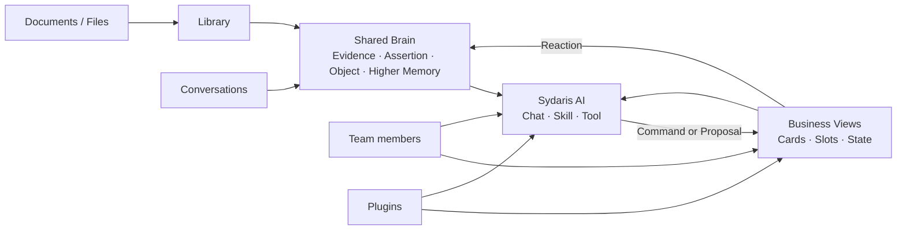

# Sydaris

> A workspace where organizational knowledge endures, work stays current, and AI helps move both forward.

Sydaris 让团队积累的知识持续可用，让正在推进的工作保持清晰，并让 AI 在二者之间真正参与协作。

项目最初来自中国科学技术大学乒乓球协会的真实需求：换届之后，新成员需要接手历届资料、组织经验和仍在变化的活动工作。Sydaris 让这三部分在成员、Agent 与会话之间持续衔接。

当前版本为 `0.1 alpha`。

## 从一次真实接手开始

一名第一次负责“继往开来”交流赛的成员问：

> 根据往届策划和复盘、今年的成员分工与当前活动进度，帮我检查还有哪些工作需要安排。

Sydaris 会沿着同一条工作线完成这件事。

### 1. 找到组织已经积累的知识

AI 从 Library 和 Shared Brain 找到历届活动流程、场地经验、宣传安排与复盘结论，并回到原始资料核对关键依据。

### 2. 理解今年正在发生的工作

Activity Operations View 保存本届活动的负责人、工作包、任务、里程碑和依赖。AI 因此能够把历史经验放到今年的真实进度中理解。

### 3. 与成员共同推进下一步

Activity Skill 识别当前缺口，并提出新增任务、调整负责人或补充里程碑的建议。需要成员确认的修改形成 Proposal；批准后，Domain Command 更新所有人共享的正式状态。

### 4. 让这次工作成为下一次的起点

执行结果、成员补充的解释和最终复盘继续维护活动的长期认知。下一届负责人可以直接从更新后的组织知识和新的本届工作状态继续工作。

四个步骤共同构成一次完整协作：Sydaris 记得组织经历过什么，理解现在正在做什么，帮助团队采取行动，并把行动结果带入下一轮工作。

## 工作方式



资料和对话沉淀为长期知识，Business View 保存当前业务状态。AI 同时理解这两部分，并通过正式 Command 参与工作；完成的工作继续丰富后续认知。

## 四个持续连接的部分

| 持续连接的内容 | Sydaris 如何承载 |
| --- | --- |
| 组织经历过什么 | Library 保存来源，Shared Brain 连接 Evidence、Assertion、Object 与 Higher Memory |
| 当前正在做什么 | Business View 用 Cards、Dimensions 与 Slots 表达该领域的正式状态 |
| 接下来如何行动 | Skill 组织专业工作流，Proposal 与 Command 将建议变成可审核、可执行的业务操作 |
| 这次行动留下什么 | Execution 记录结果，Reaction 维护未来 AI 需要理解的高层认知 |

每个部分回答不同的工作问题，又在同一次任务中连续使用。新的业务领域可以拥有自己的 View、Presentation 与 Skill，同时复用已有组织知识和 Agent Runtime。

## 内置 Plugin

| Plugin | 业务范围 |
| --- | --- |
| `sydaris.society-information` | 组织身份、人物、学年职位、长期活动与平台入口 |
| `sydaris.activity-operations` | 活动、Playbook、工作包、任务、分工、里程碑与依赖 |
| `sydaris.competition-records` | 比赛届次、长期赛事系列与来源数据同步 |

Competition Records 可以连接 USTCTTA 比赛源库；配置 `USTCTTA_DATABASE_URL` 或 `USTCTTA_DATABASE_URL_UNPOOLED` 后即可启用来源读取与同步能力。

## 本地运行

### 环境要求

- Node.js 20+
- pnpm
- PostgreSQL，或仓库提供的 Prisma 本地开发数据库
- 一个 OpenAI-compatible 文字模型
- Python 3.11 或 3.12 与 [`uv`](https://docs.astral.sh/uv/)

完整 Shared Brain 检索使用 BGE-M3。MinerU 与视觉模型用于相应文档和图片的深度处理。

### 1. 安装与配置

```bash
pnpm install
cp .env.example .env
```

在 `.env` 中填写文字模型：

```env
AI_API_KEY=
AI_API_BASE_URL=https://api.openai.com/v1
AI_MODEL=
```

使用学校 MinerU 文件解析接口时，再配置：

```env
COLD_START_MINERU_PROVIDER=auto
MINERU_MODEL=mineru
MINERU_API_KEY=
MINERU_API_BASE_URL=https://api.llm.ustc.edu.cn/v1
```

`MINERU_API_KEY` 留空时会复用 `AI_API_KEY`。配置了 `MINERU_API_BASE_URL` 后，`auto`
默认调用同一主机的 `/mineru/file_parse`；设置 `COLD_START_MINERU_PROVIDER=local`
可以显式切回本地 MinerU CLI。API 和本地结果都会归一化为同一个 `ParsedDocument`
并进入相同的 SHA-256 解析缓存和后续认知编译流程。学校 API 使用服务端默认解析引擎；
`COLD_START_MINERU_BACKEND` 等质量参数只用于本地 CLI，不会发送给学校接口。

`.env.example` 还包含数据库、模型限速、视觉模型、Library、Shared Brain 与调试选项。

### 2. 启动数据库

```bash
pnpm prisma:dev
pnpm prisma:deploy
pnpm prisma:generate
```

使用已有 PostgreSQL 时，在 `.env` 中配置 `DATABASE_URL` 和 `SHADOW_DATABASE_URL`。

### 3. 启动 Shared Brain 检索

在独立终端启动 BGE-M3 embedding 服务：

```bash
pnpm memory:serve-embeddings
```

首次运行可能下载模型。也可以通过 `COLD_START_EMBEDDING_MODEL` 使用本地模型路径。

轻量界面预览可以设置 `MEMORY_RETRIEVER_MODE=disabled`；完整认知体验使用默认的 `object-assertion` 模式。

### 4. 启动 Sydaris

```bash
pnpm dev
```

访问 [http://localhost:3000/setup](http://localhost:3000/setup) 创建第一个管理员。进入 Library 导入资料并启动基础编译，完成后即可在 Shared Brain 与 AI 对话中使用这些知识。

认知编译、Parser 和 embedding 服务的详细说明见 [`services/cold-start`](services/cold-start/README.md) 与 [`services/mineru-parser`](services/mineru-parser/README.md)。

### 保存和切换本机状态

录制、调试或复现流程时，可以把 PostgreSQL、Library 原始文件和冷启动解析产物保存为同一个命名状态：

```bash
pnpm state:save -- before-import
pnpm state:list
pnpm state:verify -- before-import
pnpm state:load -- before-import --yes
```

状态默认保存在 `.sydaris-states/<name>`，不会切换 Git。`state:load` 会先创建一个 `autosave-*` 安全状态，再恢复目标数据库与文件目录；失败时会尝试自动回滚。重复使用同名状态需要在保存时添加 `--replace`。

保存或加载前应结束正在提交的聊天与文件写入。命令默认拒绝存在 `queued` / `running` 资料编译任务时操作；确实只想保存当前已经持久化的最佳努力状态时，可以对 `state:save` 添加 `--allow-active`，但加载前仍应先暂停旧 worker。文件复制在 macOS/APFS 上优先使用 copy-on-write clone，其他文件系统会退回普通复制。

完整的使用流程、命令速查、环境准备和故障排查见 [`STATE_MANAGEMENT.md`](STATE_MANAGEMENT.md)。

## 用 Plugin 扩展 Sydaris

一个 Plugin 可以组合四类 Extension：

| Extension | 提供的能力 |
| --- | --- |
| `ViewModule` | 业务状态、Commands、Invariants 与 Events |
| `PresentationExtension` | 面向该 View 的专属界面与交互 |
| `SkillExtension` | AI 的专业工作流程与 Command 权限 |
| `ToolProviderExtension` | 日历、邮件和业务系统等外部 Capability |

Plugin 使用静态注册，与 Sydaris 一起构建：

```bash
pnpm sydaris:plugin install ./my-plugin.tgz
pnpm sydaris:plugin list
pnpm sydaris:plugin generate --check
```

- [`packages/plugin-sdk`](packages/plugin-sdk/README.md)：公共 TypeScript contracts、React hooks 与包格式
- [`packages/example-plugin`](packages/example-plugin/README.md)：可复制的完整 Plugin 示例
- [`CONTRIBUTING.md`](CONTRIBUTING.md)：Runtime 边界、开发流程与验证要求

## 仓库结构

```text
src/
├── contracts/        Stable Runtime contracts
├── runtime/          Extension host / Tool runtime
├── view-runtime/     View state, Command and Proposal runtime
├── agent-runtime/    AI-facing View, Skill and Tool runtime
├── ai/               Chat orchestration and grounding
├── memory/           Shared Brain / Cognitive Runtime
├── evidence/         Evidence-layer semantics
├── library/          Source documents and knowledge compilation
├── plugins/          First-party Plugins
├── integrations/     Host-owned external workflows
├── shell/            Composition Root
├── app/              Next.js application and API routes
└── auth/             Identity and session

packages/
├── plugin-sdk/       Public Plugin SDK
└── example-plugin/   Publishable example

services/
├── cold-start/       Cognitive compilation and BGE-M3 service
└── mineru-parser/    Document parser service

prisma/               Current schema and initial migration baseline
```

## 当前版本

Sydaris `0.1 alpha` 已经连通 Library、Shared Brain、Business View、Agent、Skill、Proposal / Command 与 Reaction。当前版本使用一个 Shared Brain，并以可信、静态安装的 Plugin package 扩展业务；Plugin SDK 和公共 API 将继续随首个稳定版本演进。

## 验证

```bash
pnpm lint
pnpm test
pnpm exec tsc --noEmit
pnpm prisma validate
pnpm build
```

## 参与项目

开发流程与架构约定见 [`CONTRIBUTING.md`](CONTRIBUTING.md)。

## 许可证

Sydaris 使用 [Apache License 2.0](LICENSE)。
