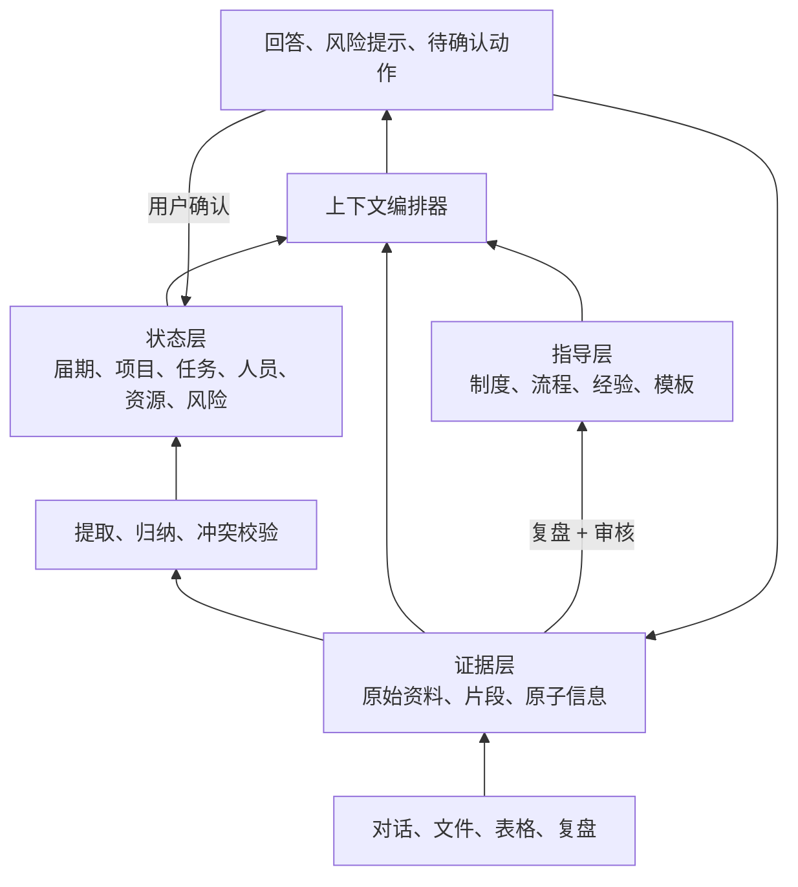

# 社团智能体知识架构与实施路线

> 状态：第一版设计基线  
> 目标：把社团经验传承做成可指导日常工作的智能体闭环，而不是“聊天 + 文档检索”。  
> 参考资料：[乒协生存手册](./USTC_TTA_乒协生存手册.pdf)

## 1. 核心判断

本项目的主轴是：组织运行知识如何形成、如何被使用、如何持续进化。

系统采用三层结构：

1. **证据层**回答“发生过什么”：保存原始文件、对话、附件及其可追溯原子信息。
2. **状态层**回答“现在是什么”：保存届期、项目、任务、人员、资源、风险等可操作状态。
3. **指导层**回答“接下来应该怎么做”：保存制度、流程、经验、模板和复盘结论。

三层是一个有明确方向的闭环，而不是三套孤立知识库：



必须遵守以下边界：

- 原始资料只追加，不由模型覆盖或改写。
- 模型提取的信息先是候选，不自动成为事实或状态。
- 状态变更必须由用户确认或确定性系统动作产生。
- 指导规则只能指导行为，不能伪装成当前事实。
- 每项建议都应能解释其依据：使用了哪条指导、读取了哪些状态、引用了哪些资料。

## 2. 为什么从指导层开始

指导层是正确的产品设计抓手，但不能成为脱离数据与状态的独立功能。

每一张指导卡都要反推下面五件事：

`指导卡 → 所需状态字段 → 所需证据 → 可执行动作 → 验收案例`

| 指导规则 | 需要的状态 | 需要的证据 | 系统动作 |
| --- | --- | --- | --- |
| 大型赛事需提前完成审批 | 项目摘要、日期、已确认的赛事规模与审批状态 | 策划案、审批记录 | 预警并创建审批任务 |
| 预算先行、材料闭环 | 预算状态、支出、结项状态 | 发票、支付记录、签领表 | 列出缺失材料与风险 |
| 换届必须完整交接 | 未结任务、账号、资产、联系人 | 清单、文档、盘点记录 | 生成交接包与核对清单 |

因此采用“**顶层设计先行，代码纵向切片落地**”：

- 先明确规则与预期行为。
- 再只实现支撑该规则所需的最小状态和证据能力。
- 不先做泛化知识库、完整文件系统、复杂仪表盘或多智能体。

## 3. 手册内容的系统归位

《乒协生存手册》是指导层的重要种子，但整本手册不应全部进入指导层。

| 手册内容 | 系统归位 | 作用 |
| --- | --- | --- |
| 历史沿革、活动介绍、历届材料 | 证据层与组织画像 | 提供背景、检索和追溯 |
| 组织架构、当前负责人、现状问题 | 状态层 | 描述谁负责什么、有哪些风险 |
| “活动运营 + 行政 + 品牌 + 传承”框架 | 指导层分类 | 定义能力边界与知识目录 |
| 审批、经费、场地、赛事 SOP | 指导卡 | 触发风险检查、计划与任务 |
| 交接、培养、项目授权 | 指导卡与状态检查表 | 支持换届和成员成长 |
| 个人经历、改革反思、踩坑过程 | 决策记录与经验卡 | 保存“为什么这样做”与适用条件 |

需要区分四类内容：

1. **硬规则**：制度、时间红线、合规要求。给出阻断或高优先级提醒。
2. **标准流程**：项目筹备、结项、交接等有固定顺序的工作。生成阶段任务。
3. **经验建议**：物资预留、现场调度方法等。作为建议，允许不采纳。
4. **时效信息**：报销金额、联系人、学校政策。标记来源、有效期和复核日期，不能写死为永久规则。

## 4. 指导层的数据结构

指导层的最小单元是“指导卡”，而不是一段 Prompt 或一篇长文。

```ts
type Guideline = {
  title: string;
  type: "policy" | "workflow" | "checklist" | "experience" | "template";
  scope: "organization" | "role" | "project";
  appliesTo: string[];
  trigger: string;
  conditions: string[];
  priority: "blocking" | "high" | "normal" | "suggestion";
  instruction: string;
  suggestedActions: string[];
  requiredStateFields: string[];
  requiredEvidence: string[];
  exceptions: string[];
  sourceRefs: string[];
  validFrom?: string;
  reviewAt?: string;
  status: "draft" | "published" | "archived";
};
```

首版优先录入下列 12 张指导卡：

1. 无审批不开展活动。
2. 大型赛事审批时间红线。
3. 常规活动审批时间红线。
4. 预算必须在活动前确认。
5. 报销材料与物资数量必须闭环。
6. 场地申请与大规模占馆要求。
7. 大型赛事的行政、物资、现场、收尾四阶段流程。
8. 新闻稿、结项、报销的行政闭环。
9. 核心物资与钥匙权限管理。
10. 换届的工作、账号、物资、关系四类交接。
11. 新成员见习到项目主理人的培养路径。
12. 复盘、风险记录和经验发布机制。

## 5. 首个黄金场景

首版只打透一个场景：

> **筹备一场大型赛事项目时，智能体根据指导层检查项目状态、识别风险、生成待确认任务，并在赛后沉淀经验。**

演示流程：

1. 用户输入：“两周后要办一场全校比赛，帮我开始准备。”
2. 系统创建项目草稿，根据摘要和资料提出“大型赛事”等结构化事实，并等待人确认。
3. 系统加载大型赛事、审批、预算、场地、物资相关指导卡。
4. 系统读取当前项目状态，给出“已具备 / 缺失 / 风险 / 建议动作”。
5. 用户确认后，系统创建审批、预算、场地、通知等任务。
6. 用户补充会议纪要或策划案，系统提取信息候选并请求确认。
7. 项目进入收尾后，系统生成复盘草稿和经验候选卡。
8. 经验审核发布后，未来同类项目自动获得更好的指导。

至少准备三个验收案例：

- 正常案例：活动还有充足准备时间，系统生成完整计划。
- 临期案例：活动临近但审批未完成，系统给出高优先级风险与补救任务。
- 材料案例：报销缺少签领表或结项材料，系统指出无法闭环的原因。

## 6. 分阶段开发路线

### 阶段 0：设计基线

目标：让团队对首版范围和验收方式达成一致。

- 确定黄金场景与三个验收案例。
- 录入首批 12 张指导卡。
- 为每张指导卡写出触发输入、所需状态、预期动作和失败情形。
- 列出首版状态字段，不新增未被指导卡或场景需要的实体。

验收：不用运行系统，团队也能完整讲清“输入 - 指导 - 状态 - 动作 - 沉淀”的链路。

### 阶段 1：指导层原型

目标：让系统能够基于项目状态和已确认事实给出可解释的建议。

- 将首批指导卡先以种子数据保存，不急于做复杂编辑器。
- 实现指导卡筛选、优先级排序和冲突提示。
- 将聊天回答固定为：当前状态、风险、建议、待确认动作、依据。
- 定义届期、项目与任务的最小状态字段，暂不接入可确认写入闭环。

验收：对“临近活动但审批未完成”的输入，系统稳定给出风险、依据和下一步动作。

### 阶段 2：最小状态闭环

目标：让建议变成可确认、可追踪的工作。

- 建立 `Member`、`OrganizationTerm`、`Project`、`Task`、`Guideline`、`ActionProposal`、`StateEvent`。
- 让聊天接口返回结构化动作候选，而不仅是自然语言。
- 在界面上实现确认、拒绝、编辑动作。
- 确认后写入任务或项目状态，并在下一轮对话中读取。

验收：创建项目、确认任务、更新进度后，再问“还缺什么”能得到正确的状态感知回答。

### 阶段 3：证据层向上沉淀

目标：让对话和资料持续补全组织记忆。

- 保存聊天记录、上传资料和来源元数据。
- 从会议纪要、策划案中提取事实候选、任务候选、风险候选。
- 为每个状态变更记录来源与确认人。
- 实现冲突提示，禁止模型静默覆盖既有状态。

验收：粘贴一段会议纪要后，系统能提出合理的状态更新候选，并能说明来源。

### 阶段 4：复盘回流与经验发布

目标：让底层资料真正成长为顶层指导。

- 生成项目复盘草稿。
- 将复盘拆为有效做法、踩坑点、适用条件、下次建议。
- 创建经验候选卡并支持人工审核、编辑、发布。
- 已发布经验在未来同类项目中参与指导。

验收：一次复盘发布后，后续同类项目的建议中能明确体现该经验。

### 阶段 5：比赛演示与稳定性

目标：证明系统不是“聊天 + 文档检索”，而是可运行的组织智能体。

- 固化演示数据与测试脚本，不依赖现场真实资料。
- 准备正常、临期、资料缺失三类案例。
- 展示每条建议对应的规则、状态和来源。
- 补齐异常处理、空状态、模型失败和人工确认流程。

验收：离线演示环境中，任何队员都能稳定完成完整演示。

## 7. 首版数据模型边界

每个部署只服务一个社团。社团稳定身份保存在 `config/organization.md`，不建立 `Organization` 数据表；详细约束见[状态层周期与工作记忆设计](./05-状态层周期与工作记忆设计.md)。首版只需要以下对象：

- `Member`：跨届期存在的成员本体。
- `OrganizationTerm`：由实际换届划分的届期。
- `Project`：属于一个届期、表达完整目标的工作范围；不保存固定活动类型。
- `Task`：属于一个项目、表达实现项目目标的具体行动；不允许脱离项目独立存在。
- `Source`：聊天、文件、导入资料等原始来源。
- `Observation`：来自来源的原子信息候选。
- `Guideline`：指导卡。
- `ActionProposal`：智能体提出、等待用户确认的动作。
- `StateEvent`：确认后的状态变更记录。

暂不做：

- 通用多智能体协作。
- 全量文件解析与复杂权限体系。
- 所有项目场景的完整 SOP。
- 大型仪表盘、自动排班、自动执行外部操作。
- 将未经审核的模型回答写入长期知识。

## 8. 三人协作建议

| 角色 | 主要职责 | 本阶段交付 |
| --- | --- | --- |
| 你 | 架构决策、数据模型、智能体编排、最终集成 | 指导卡标准、核心接口、代码审查 |
| 队友 A | 指导内容整理与评测 | 首批指导卡、测试案例、预期输出 |
| 队友 B | 交互与演示体验 | 项目状态页、任务确认卡、风险展示、演示脚本 |

新人不应一开始承担模型编排或底层架构；他们最有价值的工作是把规则、案例和界面变成可验收成果，让核心逻辑由测试驱动。

## 9. 下一步清单

1. 将本手册中的首批 12 张指导卡写成结构化种子数据。
2. 定义大型赛事项目的状态字段与任务模板。
3. 为三个验收案例写出“输入、初始状态、预期建议、预期动作”。
4. 在数据库中落地最小领域对象。
5. 将聊天接口改造成“读取指导 + 读取状态 + 返回动作候选”的编排接口。

> 第一阶段的目标不是“更会聊天”，而是“每次聊天都能基于可解释的规则，推动一项可追踪的社团工作”。
