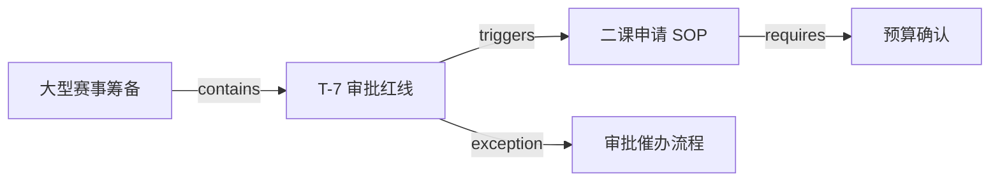

# 指导层最小数据库模型

> 状态：第一阶段实现基线  
> 范围：只覆盖指导层，不包含活动、任务、用户、原始资料和 AI 对话。

## 1. 设计目标

第一阶段只解决两件事：

1. 保存一条可发布的工作流、规则、检查表或经验。
2. 用有向连线表达这些指导之间的关系。

因此数据库只有两张核心表：

```text
guidelines        一条指导本身
guideline_links   指导之间的线
```

正式的数据库定义位于 [`prisma/schema.prisma`](../../prisma/schema.prisma)。通过 `pnpm prisma:dev` 创建本机开发数据库后，使用本机主库端口 `51214` 与影子库端口 `51215` 配置 `.env`，再运行 `pnpm prisma:migrate -- --name init_guidance_schema` 生成 Prisma 的第一份迁移；不再维护独立的手写 SQL Schema。

不在本阶段实现：版本历史、精确文件引用、通用属性词典、动作模板复用、跨社团隔离和图数据库。当前代码仓库的 Git 提交与 PR Review 已经承担初步的修改历史和人工审核职责。

## 2. `guidelines`

一行就是当前可用的一条 Guideline。

| 字段 | 说明 |
| --- | --- |
| `id` | 数据库内部唯一标识。连线依赖它；改标题不会破坏关系。 |
| `title` | 展示给维护者和用户的标题。 |
| `kind` | `workflow`（工作流）、`rule`（规则）、`checklist`（检查表）、`experience`（经验）。 |
| `content_markdown` | 给人阅读的详细说明，可写背景、步骤和注意事项。 |
| `is_mandatory` | 是否必须遵守。它表示规则强度，不表示当前紧急程度。 |
| `applies_when_jsonb` | 可选的结构化触发条件。为空时由工作流、人工选择或后续解析器决定是否加载。 |
| `suggested_actions_jsonb` | 可选的建议动作数组；只提出动作，不直接修改活动状态。 |
| `basis_note` | 可选形成依据摘要，例如“整理自生存手册、赛事复盘和干事讨论”。不强制精确关联文件。 |
| `status` | `draft` 不参与运行时指导；`published` 可被读取。 |
| `created_at` | 创建时间。 |
| `updated_at` | 最后编辑时间；首版由应用层维护。 |

### 条件示例

```json
{
  "all": [
    { "field": "activity.type", "operator": "eq", "value": "large_tournament" },
    { "field": "activity.days_until_event", "operator": "lte", "value": 7 },
    {
      "field": "activity.approval_status",
      "operator": "not_in",
      "value": ["submitted", "approved"]
    }
  ]
}
```

### 建议动作示例

```json
[
  {
    "type": "create_task",
    "title": "提交二课申请",
    "due": "活动前 7 天"
  },
  {
    "type": "request_information",
    "title": "确认活动日期、场地和预计参与人数"
  }
]
```

## 3. `guideline_links`

一行是一条有向连线。它不保存条件；条件只保存在被激活 Guideline 的 `applies_when_jsonb` 中，避免两处重复维护。

| 字段 | 说明 |
| --- | --- |
| `from_guideline_id` | 连线起点，即当前 Guideline。 |
| `to_guideline_id` | 连线终点，即被包含、触发、要求、衔接或作为例外处理的 Guideline。 |
| `relation_type` | 连线类型。 |
| `note` | 供维护者理解关系的可选备注，不参与程序判断。 |
| `created_at` | 连线创建时间。 |

`from_guideline_id + to_guideline_id + relation_type` 是联合主键，因此一条相同方向、相同类型的关系不会重复出现。

| `relation_type` | 含义 | 示例 |
| --- | --- | --- |
| `contains` | 工作流包含该指导 | 大型赛事筹备 → T-7 审批红线 |
| `triggers` | 当前指导命中后进入另一指导 | T-7 审批红线 → 二课申请 SOP |
| `requires` | 当前指导依赖另一指导先满足 | 奖品采购 → 预算确认 |
| `next` | 一般流程下一步 | 报名通知 → 现场准备 |
| `exception` | 特殊处理路径 | 审批红线 → 审批催办流程 |

## 4. 示例图



“审批催办流程”自身的 `applies_when_jsonb` 负责判断“审批已提交且长期未反馈”，而不是把同一条件存入连线。

## 5. 后续何时扩展

只有出现真实需求时再增加表：

| 真实需求 | 再增加的能力 |
| --- | --- |
| 系统内多人编辑且需要逐版回溯 | `guideline_revisions` |
| 每条指导需要精确回链 PDF/复盘 | `guidance_source_refs` |
| 多条指导复用同一动作 | `action_templates` |
| 自定义属性和别名开始大量出现 | `fact_definitions` |
| 支持多个社团 | `organization_id` |
