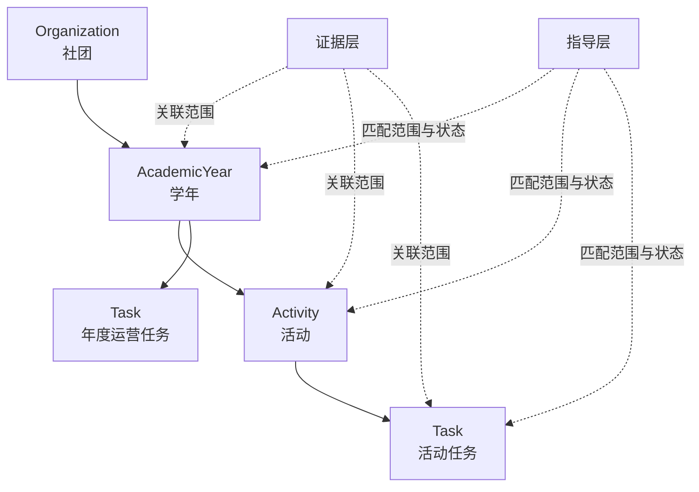

# 状态层周期与工作记忆设计

> 状态：设计基线，尚未进入数据库实现  
> 目标：在不混淆证据层、状态层和指导层的前提下，建立“学年 → 活动 → 任务”的运营主轴，并让智能体对近期工作保持连续、可追溯的记忆。  
> 上位设计：[社团智能体知识架构与实施路线](./01-智能体知识架构与实施路线.md)

## 1. 核心判断

系统中存在两条彼此正交的轴：

1. **知识语义轴**：证据层回答“发生过什么”，状态层回答“现在是什么”，指导层回答“接下来应该怎么做”。
2. **运营范围轴**：学年、活动、任务回答“这项信息属于哪段组织运行过程”。

因此，“学年 → 活动 → 任务”不是额外的三层知识库，而是状态层中的主要工作范围，也是证据和指导建立关联时共同使用的坐标。



主路径是 `AcademicYear → Activity → Task`，但不能强制所有任务属于单次活动。换届、资产盘点、成员培养等持续运营工作应直接属于学年，因此 `Task.academicYearId` 必填，`Task.activityId` 可空。若任务属于活动，必须保证任务与活动属于同一学年。

## 2. 状态层不是“所有未归档记录”

数据库负责保存完整、可靠的状态和历史；状态层在一次对话中读取的是根据当前范围构建的**工作上下文投影**。

归档只表示：

- 默认工作列表不再展示该对象；
- 对象已基本冻结，不再被当作当前待办；
- 常规上下文不会无条件加载它；
- 仍可按明确引用或相关性重新检索。

归档不等于删除，也不等于遗忘。业务完成状态与归档状态必须分开表达：

- `completedAt` 表示业务已经完成；
- `archivedAt` 表示对象退出默认工作视图；
- 活动完成后仍可因为近期发生、存在遗留事项或被用户再次提及而进入工作记忆。

建议的生命周期为：

- `AcademicYear`：`planned → active → closing`，归档另由 `archivedAt` 表示；
- `Activity`：`draft → planning → preparation → active → closing → completed`，另允许 `cancelled`；
- `Task`：`todo → in_progress ↔ blocked → done`，另允许 `cancelled`。

活动现场结束后应先进入 `closing`，继续处理新闻稿、结项、报销、物资归还和复盘，而不是立即归档。

## 3. 三种记忆范围的实现区别

| 记忆范围 | 持久化形态 | 加载方式 | 作用 |
| --- | --- | --- | --- |
| 对话焦点 | `ConversationContext` | 每轮确定性加载 | 保存当前学年、活动、任务及最近提及对象 |
| 工作记忆 | 当前状态查询 + `MemoryDigest` | 后端每轮自动编排 | 提供近期变化、未结事项、关键决定和可深入读取的来源索引 |
| 长期记忆 | 归档状态、`StateEvent`、原始文件与复盘 | 按明确引用或相关性检索 | 在需要时恢复往年活动和原始细节 |

### 3.1 对话焦点

`ConversationContext` 至少记录：

- `conversationId`；
- `academicYearId`；
- 可选的 `activityId`；
- 可选的 `taskId`；
- 最近提及对象及更新时间。

活动完成不会自动清除对话焦点。只有用户切换主题、明确选择其他对象或系统在歧义消解后确认了新范围，焦点才改变。

### 3.2 工作记忆

工作记忆不等于“让模型自行浏览最近文档”。在模型回答前，应用先通过确定性查询选择候选内容：

1. 当前对话焦点及其父级范围；
2. `active` 或 `closing` 的活动；
3. 存在未完成、阻塞或临期任务的活动；
4. 最近完成或最近被更新、提及的活动；
5. 被人工标记为重要的事项。

候选内容按上下文预算压缩为结构化摘要，例如：

```text
工作记忆，截至 2026-07-15

近期活动：
- 校赛：昨天结束，处于收尾阶段。

未结事项：
- 报销材料缺少签领表。
- 活动复盘尚未完成。

近期决定：
- 剩余奖品转入社团库存。

可深入读取：
- 现场记录 source-456
- 活动预算表 source-789
```

`MemoryDigest` 是可重新生成的上下文缓存，不是权威事实。建议至少包含：

- `scopeType`、`scopeId`；
- `summary`；
- `openLoops`；
- `recentDecisionRefs`；
- `stateEventRefs`；
- `sourceRefs`；
- `asOfVersion`、`generatedAt`。

当活动阶段、重要任务或已确认决定发生变化时，聚合版本增加。若 `MemoryDigest.asOfVersion` 落后，则重新生成或标记为过期。无需在每条普通聊天后都调用模型总结。

### 3.3 长期记忆

长期记忆不只是保存文件，还包括：

- 已归档的学年、活动和任务快照；
- 追加保存的 `StateEvent`；
- 原始文件、对话、会议纪要及其索引；
- 已审核的复盘和指导卡。

模型默认不读取整份长期记忆。它先看到工作记忆中的实体 ID 和 `sourceRefs`，发现需要细节后，再通过工具读取：

- `get_activity_state(activityId)`；
- `search_history(query, scope, timeRange)`；
- `open_source(sourceId)`。

Skill 可以规定何时以及如何调用这些工具，但不能代替后端自动提供工作记忆。否则模型在尚不知道近期发生了什么时，就要先决定是否检索，容易漏掉未结事项。

## 4. 上下文编排顺序

每轮对话使用同一条可解释链路：

```text
用户消息
→ 解析明确提及与当前对话焦点
→ 沿 Task → Activity → AcademicYear → Organization 读取父级状态
→ 自动构建受预算限制的工作记忆
→ 加载匹配当前范围与状态的 Guideline
→ 模型回答，或按需检索长期记忆
→ 产生回答、信息请求或 ActionProposal
```

注入给模型的上下文应明确分区：

1. **当前焦点**：详细、权威的结构化状态；
2. **工作记忆**：带时间戳的近期摘要、未结事项和来源索引；
3. **检索历史**：仅在需要时加入的原文片段；
4. **适用指导**：规则、流程、检查表及其依据。

事实冲突时遵循以下优先级：

```text
已确认的结构化状态
> StateEvent
> 原始证据中的待确认观察
> MemoryDigest 生成摘要
> 模型推测
```

## 5. 最小数据对象与约束

首个状态闭环只引入以下对象：

- `Organization`：组织根实体；
- `AcademicYear`：活动和年度运营任务的归属范围；
- `Activity`：活动状态快照；
- `Task`：可追踪工作，允许直接属于学年；
- `ActionProposal`：等待确认的结构化动作；
- `StateEvent`：确认后追加的状态变更审计；
- `ConversationContext`：当前对话焦点；
- `MemoryDigest`：可再生的工作记忆摘要。

必须满足：

1. 每个 `Activity` 恰好属于一个 `AcademicYear`；
2. 每个 `Task` 恰好属于一个 `AcademicYear`，可选属于一个 `Activity`；
3. 活动任务与活动的 `academicYearId` 必须一致；
4. 同一学年允许多个活动和任务并行；
5. 学年关闭或归档不能级联完成、归档或删除未结子对象；
6. 跨学年遗留事项保留原记录，并通过后继任务显式接续，不直接改写原归属；
7. `days_until_event`、是否逾期、任务完成率等派生状态实时计算，不作为长期事实保存；
8. 不使用一个无类型约束的 `Cycle(kind, parentId, dataJson)` 代替具体实体。

人员和资产本体长期属于 `Organization`，其年度角色、盘点记录、活动借用记录再关联到学年或活动，避免每个学年重复创建同一个人或同一件资产。

## 6. 状态写入边界

模型不能直接修改状态。唯一允许的写入链路是：

```text
对话或文件
→ Observation / ActionProposal
→ 用户确认或确定性系统动作
→ 校验权限、状态转换和 expectedVersion
→ 同一事务更新状态快照、追加 StateEvent、接受 Proposal
```

`MemoryDigest` 只从已确认状态、已记录事件和有来源的证据生成，不把未经确认的模型回答写回状态层。摘要过期或生成失败不会阻断状态读取，系统应退回结构化状态和近期事件。

## 7. 小步实施路线

为了让每一步都容易理解和回退，后续实现按以下检查点推进；一个检查点完成并验收后再进入下一个。

### 检查点 0：设计基线

- 只新增本文档；
- 不修改数据库和运行代码；
- 验收：能够解释两条轴、三种记忆、归档与遗忘的区别。

### 检查点 1：状态关系骨架

- 新增 `Organization`、`AcademicYear`、`Activity`、`Task`；
- 只实现关系、生命周期和数据库约束；
- 暂不接聊天、摘要或向量检索；
- 验收：可以保存一个学年、两个并行活动、活动任务和年度任务。

### 检查点 2：可确认的状态变更

- 新增 `ActionProposal`、`StateEvent` 和聚合版本；
- 用事务实现“确认任务候选 → 创建任务 → 记录事件”；
- 验收：模型候选不能绕过确认直接改变状态，旧版本候选不能静默执行。

### 检查点 3：确定性上下文

- 新增 `ConversationContext` 和 `buildWorkingSet()`；
- 先加载结构化状态、近期事件和未结事项，不生成 AI 摘要；
- 提供调试输出，让维护者能看见每条内容为什么被加载；
- 验收：活动结束后仍处于焦点或收尾期时，下一轮对话不会立即遗忘。

### 检查点 4：工作记忆摘要

- 新增 `MemoryDigest`；
- 只总结已确认状态，并保留事件和来源引用；
- 用聚合版本判断摘要是否过期；
- 验收：模型先读简洁摘要，需要细节时能指出应读取哪个来源。

### 检查点 5：长期记忆检索

- 接入 `search_history` 与 `open_source`；
- 先做元数据和关键词检索，真实需要出现后再增加向量检索；
- 验收：筹备新活动时能够找回相关往年复盘，同时说明来源和适用边界。

每个检查点只引入一个新的核心概念，并交付：变更文件清单、数据流说明、测试结果、已知限制和下一步建议。未经单独确认，不跨检查点扩展实现。

## 8. 首批验收场景

1. **活动刚结束**：活动进入 `closing`，仍在对话焦点和工作记忆中，未结报销与复盘被自动加载。
2. **活动已归档**：默认上下文不加载该活动；用户明确提到它时可以重新读取状态和来源。
3. **同类活动复用**：筹备新的大型赛事时，工作记忆不塞入所有往年记录，但模型可以检索最相关的历史复盘。
4. **年度运营任务**：学期末资产盘点直接属于学年，不需要创建虚假的活动。
5. **并行活动**：同一学年两个活动同时进行，系统不维护全局唯一的“当前活动”，而以对话范围和明确实体 ID 区分。

> 智能感不来自一次把所有历史塞进上下文，而来自稳定地知道“现在在谈什么、最近发生了什么、还有什么没闭环，以及需要时去哪里找原始依据”。
