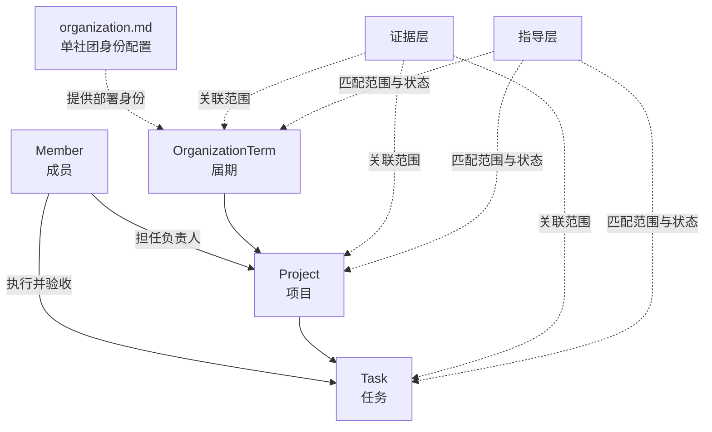

# 状态层周期与工作记忆设计

> 状态：设计基线，尚未进入数据库实现  
> 目标：在不混淆证据层、状态层和指导层的前提下，建立“届期 → 项目 → 任务”的运营主轴，并让智能体对近期工作保持连续、可追溯的记忆。
> 上位设计：[社团智能体知识架构与实施路线](./01-智能体知识架构与实施路线.md)

## 1. 核心判断

系统中存在两条彼此正交的轴：

1. **知识语义轴**：证据层回答“发生过什么”，状态层回答“现在是什么”，指导层回答“接下来应该怎么做”。
2. **运营范围轴**：届期、项目、任务回答“这项信息属于哪段组织运行过程”。

因此，“届期 → 项目 → 任务”不是额外的三层知识库，而是状态层中的主要工作范围，也是证据和指导建立关联时共同使用的坐标。



主路径严格为 `OrganizationTerm → Project → Task`。每个任务都必须属于一个项目，不再允许任务直接挂在届期下：项目表达“最终想实现什么”，任务表达“为实现目标采取什么行动以及怎样算完成”。若一项工作只有一个行动，也应建立一个最小项目来保存目标，而不是把目标和行动混写进孤立任务。

`Project` 不只表示单次活动。大型赛事、系列训练、换届交接、资产盘点、成员培养和制度建设都可以成为项目。这样既避免用固定活动类型框死人的判断，也与《乒协生存手册》提出的项目主理人和项目制赋权方向一致。

状态层也不只是数据库的人工称呼。完整状态层由四部分组成：数据库中的已确认当前快照、控制状态如何变化的写入规则、追溯变化的 `StateEvent`，以及面向智能体构建当前焦点和工作记忆的上下文投影。检查点 1 只实现其中的关系与快照骨架。

## 2. 状态层不是“所有未归档记录”

数据库负责保存完整、可靠的当前快照；事件与证据负责保存变化和依据。状态层在一次对话中实际提供给模型的，是根据当前范围构建的**工作上下文投影**，而不是整库未归档记录。

归档只表示：

- 默认工作列表不再展示该对象；
- 对象已基本冻结，不再被当作当前待办；
- 常规上下文不会无条件加载它；
- 仍可按明确引用或相关性重新检索。

归档不等于删除，也不等于遗忘。业务完成状态与归档状态必须分开表达：

- `completedOn` 表示业务已经完成；
- `archivedAt` 表示对象退出默认工作视图；
- 项目完成后仍可因为近期发生、存在遗留事项或被用户再次提及而进入工作记忆。

建议的生命周期为：

- `OrganizationTerm`：`planned → active → closing`，归档另由 `archivedAt` 表示；
- `Project`：`draft → planning → preparation → active → closing → completed`，另允许 `cancelled`；
- `Task`：不保存人工状态枚举。`completedOn` 非空表示完成，`cancelledOn` 非空表示取消，两者均为空表示未完成；未完成且超过 `dueOn` 时派生为逾期。

活动型项目的现场结束后应先进入 `closing`，继续处理新闻稿、结项、报销、物资归还和复盘，而不是立即归档。任务的 `currentProgress` 保存负责人确认的当前进展快照；历史进展由后续 `StateEvent` 与证据保存，不在检查点 1 另建进展流水表。

届期由实际换届划分，不根据固定学年日期自动切换。起止日期允许人工编辑，日期只用于提示；未来可在换届项目进入收尾阶段时，由智能体询问会长是否开始新届期。

## 3. 三种记忆范围的实现区别

| 记忆范围 | 持久化形态 | 加载方式 | 作用 |
| --- | --- | --- | --- |
| 对话焦点 | `ConversationContext` | 每轮确定性加载 | 保存当前届期、项目、任务及最近提及对象 |
| 工作记忆 | 当前状态查询 + `MemoryDigest` | 后端每轮自动编排 | 提供近期变化、未结事项、关键决定和可深入读取的来源索引 |
| 长期记忆 | 归档状态、`StateEvent`、原始文件与复盘 | 按明确引用或相关性检索 | 在需要时恢复往届项目和原始细节 |

### 3.1 对话焦点

`ConversationContext` 至少记录：

- `conversationId`；
- `organizationTermId`；
- 可选的 `projectId`；
- 可选的 `taskId`；
- 最近提及对象及更新时间。

项目完成不会自动清除对话焦点。只有用户切换主题、明确选择其他对象或系统在歧义消解后确认了新范围，焦点才改变。

### 3.2 工作记忆

工作记忆不等于“让模型自行浏览最近文档”。在模型回答前，应用先通过确定性查询选择候选内容：

1. 当前对话焦点及其父级范围；
2. `active` 或 `closing` 的项目；
3. 存在未完成、逾期或临期任务的项目；
4. 最近完成或最近被更新、提及的项目；
5. 被人工标记为重要的事项。

候选内容按上下文预算压缩为结构化摘要，例如：

```text
工作记忆，截至 2026-07-15

近期项目：
- 校赛项目：昨天结束现场执行，处于收尾阶段。

未结事项：
- 报销材料缺少签领表。
- 项目复盘尚未完成。

近期决定：
- 剩余奖品转入社团库存。

可深入读取：
- 现场记录 source-456
- 项目预算表 source-789
```

`MemoryDigest` 是可重新生成的上下文缓存，不是权威事实。建议至少包含：

- `scopeType`、`scopeId`；
- `summary`；
- `openLoops`；
- `recentDecisionRefs`；
- `stateEventRefs`；
- `sourceRefs`；
- `asOfVersion`、`generatedAt`。

当项目阶段、任务当前进展或已确认决定发生变化时，聚合版本增加。若 `MemoryDigest.asOfVersion` 落后，则重新生成或标记为过期。无需在每条普通聊天后都调用模型总结。

### 3.3 长期记忆

长期记忆不只是保存文件，还包括：

- 已归档的届期、项目和任务快照；
- 追加保存的 `StateEvent`；
- 原始文件、对话、会议纪要及其索引；
- 已审核的复盘和指导卡。

模型默认不读取整份长期记忆。它先看到工作记忆中的实体 ID 和 `sourceRefs`，发现需要细节后，再通过工具读取：

- `get_project_state(projectId)`；
- `search_history(query, scope, timeRange)`；
- `open_source(sourceId)`。

Skill 可以规定何时以及如何调用这些工具，但不能代替后端自动提供工作记忆。否则模型在尚不知道近期发生了什么时，就要先决定是否检索，容易漏掉未结事项。

## 4. 上下文编排顺序

每轮对话使用同一条可解释链路：

```text
用户消息
→ 解析明确提及与当前对话焦点
→ 沿 Task → Project → OrganizationTerm 读取父级状态，并加载 organization.md 中的稳定组织身份
→ 自动构建受预算限制的工作记忆
→ 加载匹配当前范围与状态的 Guideline
→ 模型回答，或按需检索长期记忆
→ 产生回答、信息请求或 ActionProposal
```

注入给模型的上下文应明确分区：

1. **当前焦点**：详细、权威的结构化状态；
2. **工作记忆**：带时间戳的近期摘要、未结事项和来源索引；
3. **检索历史**：仅在需要时加入的原文片段；
4. **适用指导**：规则、流程、检查表及其依据。

事实冲突时遵循以下优先级：

```text
已确认的结构化状态
> StateEvent
> 原始证据中的待确认观察
> MemoryDigest 生成摘要
> 模型推测
```

## 5. 最小数据对象与约束

本系统每个部署只服务一个社团，不建立 `Organization` 数据表，也不给其他表增加 `organizationId`。稳定组织身份保存在 `config/organization.md`：

- `name`：中国科学技术大学校学生乒乓球协会；
- `slug`：USTC-TTA；
- 不保存组织时区；
- 正文依据《乒协生存手册》记录成立背景、宗旨、长期定位和主要服务；
- 当前会长、当前届期和成员名单等可变状态不得写入该文件。

检查点 1 的数据库对象和核心字段如下：

| 对象 | 定位 | 首批字段 |
| --- | --- | --- |
| `Member` | 跨届期存在的成员本体 | 内部 UUID、姓名、入学年份、加入日期、可选离开日期 |
| `OrganizationTerm` | 由实际换届划分的责任周期 | 名称、可编辑起止日期、阶段、可选会长、归档时间 |
| `Project` | 表达一个希望实现的完整结果 | 所属届期、标题、目标、人工确认的简短摘要、可选负责人、阶段、计划与实际日期、完成或取消日期、归档时间 |
| `Task` | 为实现项目目标采取的具体行动 | 所属项目、标题、可选负责人、描述、验收标准、当前进展、截止日期、实际完成或取消日期、归档时间 |

其中：

- `Project.goal` 明确项目最后想实现的结果，不能用一组任务标题代替；
- `Project.summary` 服务于快速理解与检索，可以由 AI 起草，但只有人工确认后的文本才能进入状态快照；
- 首版不保存固定项目类型。将来由 AI 根据摘要和资料提出诸如“面向全校”“大型赛事”“需要审批”“需要场地”等结构化事实，人工确认后再供指导层稳定判断；
- 当前指导层中已有的 `activity.*` 条件字段只是尚未接入状态层的事实接口，不代表仍需建立 `Activity` 数据表；后续由项目状态和已确认事实生成兼容输入，再单独统一命名；
- `Task.currentProgress` 是负责人确认的当前进展摘要。原始讨论与历次变化以后由证据和 `StateEvent` 追溯；
- 任务首版只有一个负责人，并由该负责人确认验收。检查点 1 尚无登录账号，因此先落实数据和业务规则，不声称已经实现身份权限校验；
- 任务创建时只强制项目和标题存在，负责人、描述、验收标准、当前进展与截止日期允许随后补齐；任务完成前必须已有负责人；
- 业务日期统一精确到自然日；`createdAt`、`updatedAt`、`archivedAt` 等系统时间使用带时区时间戳。

后续检查点再引入：

- `ActionProposal`：等待确认的结构化动作；
- `StateEvent`：确认后追加的状态变更审计；
- `ConversationContext`：当前对话焦点；
- `MemoryDigest`：可再生的工作记忆摘要。

必须满足：

1. 每个 `Project` 恰好属于一个 `OrganizationTerm`；
2. 每个 `Task` 恰好属于一个 `Project`，不允许直接属于届期，也不在任务上重复保存届期外键；
3. 即使只有一个行动，也用最小项目表达目标，再把行动保存为任务；不得建立长期存在的“日常事务”兜底项目；
4. 同一届期允许多个项目并行；至多一个届期处于 `active`，但允许上届处于 `closing` 时新届已经 `active`；
5. 项目和任务标题不要求唯一，实体使用内部 UUID 标识；
6. 项目类型不作为数据库枚举或必填分类，摘要也不能被当作未经确认即可执行的硬事实；
7. 任务不保存 `todo`、`in_progress`、`blocked`、`done` 等状态枚举；完成、取消、未完成和逾期都由日期字段派生；
8. 项目、届期关闭或归档不能级联完成、取消、归档或删除子对象；项目存在未完成任务时不得归档，届期存在未结束项目时不得归档，父级存在子对象时禁止常规硬删除；
9. 任务即使拖到下一届完成，也仍属于原项目和原届期，不迁移归属；首版不增加跨届后继任务关系；
10. 系列活动作为一个项目，每次开展作为一个任务，首次准备和最终收尾也作为该项目下的任务；首版不增加场次实体；
11. `days_until_event`、是否逾期、任务完成率等派生状态实时计算，不作为长期事实保存；
12. 同一项目或任务的 `completedOn` 与 `cancelledOn` 不得同时存在；项目终态与相应日期必须一致；
13. 计划和实际结束日期不得早于对应开始日期，但日期超出届期边界只提示，不由数据库拒绝；届期之间日期重叠也先提示，不作为首版硬约束；
14. 不使用一个无类型约束的 `Cycle(kind, parentId, dataJson)` 代替具体实体。

成员本体跨届期存在，通过届期会长、项目负责人和任务负责人关系参与当前工作，避免每届重复创建同一个人。未来资产本体也应采用相同原则，而不是复制进每个届期。

## 6. 状态写入边界

模型不能直接修改状态。唯一允许的写入链路是：

```text
对话或文件
→ Observation / ActionProposal
→ 用户确认或确定性系统动作
→ 校验权限、状态转换和 expectedVersion
→ 同一事务更新状态快照、追加 StateEvent、接受 Proposal
```

`MemoryDigest` 只从已确认状态、已记录事件和有来源的证据生成，不把未经确认的模型回答写回状态层。摘要过期或生成失败不会阻断状态读取，系统应退回结构化状态和近期事件。

## 7. 小步实施路线

为了让每一步都容易理解和回退，后续实现按以下检查点推进；一个检查点完成并验收后再进入下一个。

### 检查点 0：设计基线

- 只新增本文档；
- 不修改数据库和运行代码；
- 验收：能够解释两条轴、三种记忆、归档与遗忘的区别。

### 检查点 1：状态关系骨架

- 确立 `config/organization.md` 的单社团身份约定，不新增组织数据表；
- 新增 `Member`、`OrganizationTerm`、`Project`、`Task`；
- 只实现关系、生命周期、当前进展字段和数据库约束；
- 暂不接聊天、AI 摘要生成、结构化事实或向量检索；
- 验收：可以保存一个届期、两个并行项目及各自任务，数据库不允许创建没有项目的任务。

### 检查点 2：可确认的状态变更

- 新增 `ActionProposal`、`StateEvent` 和聚合版本；
- 用事务实现“确认任务候选 → 在明确项目下创建任务 → 记录事件”；
- 对只有一个行动的新目标，允许一次确认同时创建最小项目和首个任务；
- 验收：模型候选不能绕过确认直接改变状态，旧版本候选不能静默执行。

### 检查点 3：确定性上下文

- 新增 `ConversationContext` 和 `buildWorkingSet()`；
- 先加载结构化状态、近期事件和未结事项，不生成 AI 摘要；
- 提供调试输出，让维护者能看见每条内容为什么被加载；
- 验收：项目结束后仍处于焦点或收尾期时，下一轮对话不会立即遗忘。

### 检查点 4：工作记忆摘要

- 新增 `MemoryDigest`；
- 只总结已确认状态，并保留事件和来源引用；
- 用聚合版本判断摘要是否过期；
- 验收：模型先读简洁摘要，需要细节时能指出应读取哪个来源。

### 检查点 5：长期记忆检索

- 接入 `search_history` 与 `open_source`；
- 先做元数据和关键词检索，真实需要出现后再增加向量检索；
- 验收：筹备新项目时能够找回相关往届复盘，同时说明来源和适用边界。

每个检查点只引入一个新的核心概念，并交付：变更文件清单、数据流说明、测试结果、已知限制和下一步建议。未经单独确认，不跨检查点扩展实现。

## 8. 首批验收场景

1. **项目刚结束**：活动型项目进入 `closing`，仍在对话焦点和工作记忆中，未结报销与复盘被自动加载。
2. **项目已归档**：默认上下文不加载该项目；用户明确提到它时可以重新读取状态和来源。
3. **同类项目复用**：筹备新的大型赛事时，工作记忆不塞入所有往届记录，但模型可以检索最相关的历史复盘。
4. **单行动目标**：用户提出一次性的独立目标时，系统同时建立一个最小项目和首个任务，不创建孤立任务或“日常事务”兜底项目。
5. **系列活动**：一学期周常训练保存为一个项目，每次训练和首尾工作保存为项目任务。
6. **并行项目**：同一届期两个项目同时进行，系统不维护全局唯一的“当前项目”，而以对话范围和明确实体 ID 区分。

> 智能感不来自一次把所有历史塞进上下文，而来自稳定地知道“现在在谈什么、最近发生了什么、还有什么没闭环，以及需要时去哪里找原始依据”。
